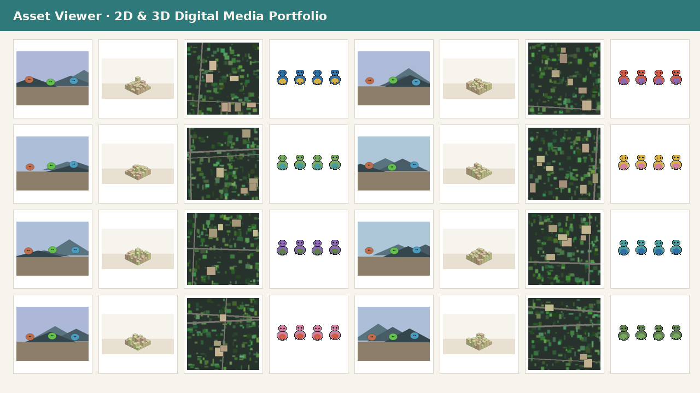

<div align="center">

# 2D & 3D Digital Media Portfolio

**by Katherine Feemster**

### Senior 2D & 3D Digital Media Specialist · GIMP · Inkscape · Krita · Libresprite · Blender · Godot

[🌐 **Live portfolio site**](https://katherinejenniferhsfeemster.github.io/2d-3d-digital-media-portfolio/) · [GitHub repo](https://github.com/katherinejenniferhsfeemster/2d-3d-digital-media-portfolio)

      

*Tool-agnostic, code-first digital media — 64 tiles, 24 pictograms, 12 painted scenes, 32 sprites, 48 rendered frames and a Godot viewer that loads them all.*

</div>

---

## Contents

- [Highlighted projects](#highlighted-projects)
- [Reproducibility](#reproducibility)
- [Tech stack](#tech-stack)
- [Editorial style](#editorial-style)
- [Repo layout](#repo-layout)
- [About the author](#about-the-author)
- [Contact](#contact)

---

## Hero



---

## Highlighted projects

| Project | Stack | What it proves |
| :-- | :-- | :-- |
| **[GIMP batch segmentation](cases/gimp/)** | GIMP 2.10 · Script-Fu | Headless Script-Fu batch: levels → unsharp → flatten → export, 64 tiles. |
| **[Inkscape parametric pictograms](cases/inkscape/)** | Inkscape 1.3 · CLI actions | 24 SVG pictograms exported at 2× DPI via `inkscape --actions=export-type:png`. |
| **[Krita painted scene exporter](cases/krita/)** | Krita 5.2 · Python plugin | Python plugin walks paint graph → per-layer PNG + mask + COCO label. |
| **[Libresprite creature atlas](cases/libresprite/)** | Libresprite · Lua | Lua CLI packs 32 creatures × 4 frames into `atlas.png` + JSON Hash. |
| **[Blender headless dataset](cases/blender/)** | Blender 4.x · bpy | `blender --background --python` renders 48 frames with bbox + mask + COCO. |
| **[Godot unified asset viewer](cases/godot/viewer/)** | Godot 4 · GDScript | `DirAccess` loader pulls every PNG from the other five cases into one grid. |

---

## Reproducibility

```bash
pip install pillow cairosvg numpy matplotlib
python3 src/run_all.py
```

Six stages. Each case also emits the native project file (`.scm`, `.kra`, `.lua`, `bpy`, `.tscn`) so the artefact opens in the real tool unchanged.

---

## Tech stack

- **GIMP 2.10** — Script-Fu batch pipelines, TinyScheme, headless `-i -b`, Python-Fu when the team prefers.
- **Inkscape 1.3** — CLI actions API (`--actions=export-type:png`), parametric SVG generation, 2× DPI rasterisation.
- **Krita 5.2** — Python plugin API (PyKrita), paint-graph walking, per-layer mask export, real `.kra` OpenRaster archives.
- **Libresprite** — Lua scripting (Aseprite-compatible), atlas packing, JSON Hash manifests with `frameTags`.
- **Blender 4.x** — `bpy` Python library, Cycles rendering, procedural scene graphs, `world_to_camera_view` for 2D/3D annotation.
- **Godot 4 & CI** — GDScript, `DirAccess` asset loaders, `--headless` runtime, GitHub Actions regenerating every artefact on push.

---

## Editorial style

- **Palette** — teal `#2E7A7B` + amber `#D9A441` on ink `#0F1A1F` / paper `#FBFAF7`.
- **Type** — Inter (UI) + JetBrains Mono (code, netlists, timecode).
- **Determinism** — every generator is seeded; PNG, CSV and project-file bytes are stable across CI runs.
- **Licensing** — every tool in the pipeline is FOSS. No commercial SDK in the dependency tree.

---

## Repo layout

```
2d-3d-digital-media-portfolio/
├── src/                         # 6 generators + art_helpers.py
├── cases/                       # one folder per tool with the native project file
├── assets/                      # generated outputs (renders, masks, labels)
├── docs/                        # GitHub Pages site
└── .github/workflows/           # CI re-runs the pipeline on each push
```

---

## About the author

Senior 2D & 3D digital media specialist shipping cross-tool asset pipelines — most recently focused on dataset generation and labelling workflows for AI research programs. Tool selection, native scripting, headless rendering and CI automation under one roof.

Open to remote and contract engagements. This repository is the living portfolio companion to my CV.

---

## Contact

**Katherine Feemster**

- GitHub — [@katherinejenniferhsfeemster](https://github.com/katherinejenniferhsfeemster)
- Live site — [katherinejenniferhsfeemster.github.io/2d-3d-digital-media-portfolio](https://katherinejenniferhsfeemster.github.io/2d-3d-digital-media-portfolio/)
- Location — open to remote / contract

---

<div align="center">
<sub>Built diff-first, editor-second. Every figure on this page is produced by code in this repo.</sub>
</div>
